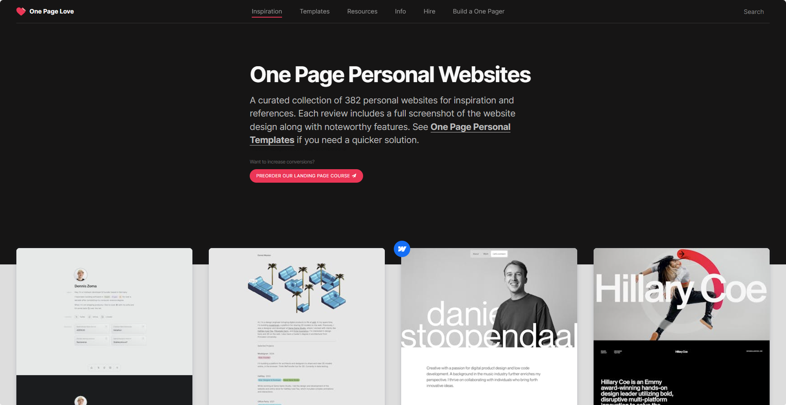
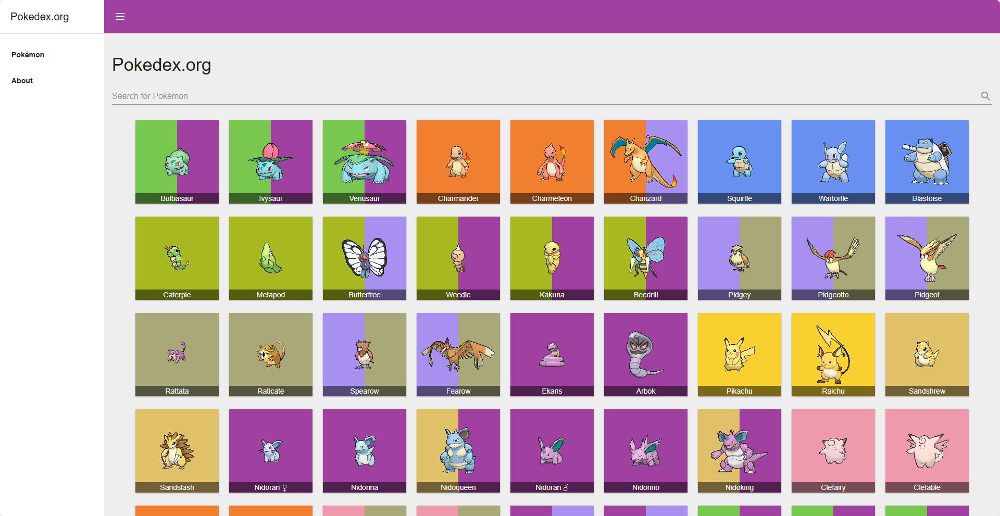

Today I'm going to share with you the 5 best React projects for beginners in 2025 and why you should complete them all.

If you're new to React then it must be daunting to see all these clone app tutorials on YouTube. I can't imagine tackling one of those as my first project if I was just starting out.

Most beginners fail to make significant progress for this reason. Taking on bigger projects then they're ready for with additional frameworks they haven't built their skills up in yet.

> If you want to stay stuck in tutorial hell then keep watching the big app clone tutorials.

In this newsletter we'll cover:

- 5 React projects you can start to tackle as a beginner (in order)
- Where to go after completing all 5
  So if you want to make progress and save yourself hours of doubt and misery then keep reading.

## 1. An FAQ Accordion

Essentially starting with just a single component building a FAQ accordion is a great exercise.

You can start with the most basic React setup possible and practice the fundamentals.

Building this will involve learning how to manage simple state, styling through your framework of choice, click events, possibly animation and you can even practice breaking down this one component into multiple smaller ones.

I'd highly recommend using Front End Mentors challenge hub page as an example of one to build.

https://www.frontendmentor.io/challenges/faq-accordion-wyfFdeBwBz

## 2. A Product List with Cart

Now that you know how to build a basic component this product list page will further that knowledge by creating a list of components.

This design also includes a cart in a side bar which will involve some more work with state.

This will build on the basic skills you learned with the first project and further them by implementing `useEffect` with data fetching for the list, possibly `context` for sharing state between the side bar and the list, hooks, more click events and typing data so that using data for example the order total is easier.

It's also a nice exercise you can make your own. You can style the list items in any way you want. Implementing static JSON data or use a API that you've always wanted to play with.

Front End Mentor has another great example design with a challenge you can do and submit.

https://www.frontendmentor.io/challenges/product-list-with-cart-5MmqLVAp_d

## 3. A Contact Form

You should be comfortable with a few tools in React before getting to this project as this will really test your usage of state and being able to handle events.

When implementing even this simple contact form you'll quickly realise that there are probably more efficient ways to handle state then how you're currently doing it. Handling forms in React is something to learn in and of itself.

This will be a good opportunity to read up on other examples to see how handling more data and inputs can be done better.

Again, and last one for now, you'll find a great example design on Front End Mentor.

https://www.frontendmentor.io/challenges/contact-form--G-hYlqKJj

## 4. Your Own Portfolio Website

By now you'll have covered most of the basic concepts of React. Building out components, nesting and looping components, managing some basic state etc.

The next project is to build your own personal portfolio website. This might sound overwhelming but you can keep things as simple or as complex as you want.

You can choose to build out multiple pages with something like React Router or keep it simple with multiple index HTML files.

You can play around with styling and even attempt a dark mode switch.

It's your portfolio so make it how you want but the best skills you can build on during this project are:

- Learning how to handle routing
- Creating templates for pages
- Importing content through static files or an external store
- Handling global state

Have fun with it. I use OnePageLove.com as a source for inspiration when I'm lacking ideas on a design for something I'm building.

https://onepagelove.com/inspiration/personal

## 5. A Pokédex!

Pokémon fan or not I think building a web based Pokédex is an amazing project everyone should try.

You gotta catch all that React experience to be the very best.

Ok, no more Pokémon quips.

This project is great to do because it reiterates over all the skills you've gathered previously and brings them all together.

Routing, data fetching, components, lists, templates, effects, state, events and so on.

This is a project you can create and enhance the more you learn.

Make sure to check out the example site site below. It's code is open source so you can see how certain things features are built. Really handy.

https://pokedex.org/

Also make sure to check out the PokéApi as a source of data to pull from.

https://pokeapi.co/

## Where do I go from here?

The best answer I can give to this is to simply keep expanding the Pokédex example.

If you're using something like GitHub create a V1 release when you finish your first build of the project so you have something complete.

And then look at what features you want to implement and what React concepts you want to learn and release new versions of the app.

There's so many things that you could learn in React but it's better to learn as you go based on what you need next.

Want to implement page transitions? Look at Framer Motion.

Want to save favourite Pokémon and login? Look at how React state can be handled with localStorage and cookies.

## Thanks for reading

This plan is just that, it's a plan, commit to getting through each of these projects from start to finish and you'll have a handful of projects to show off and you'll learn most of the React concepts you'll need along the way.

Get yourself unstuck and commit to finishing.

Thanks again 🙏
